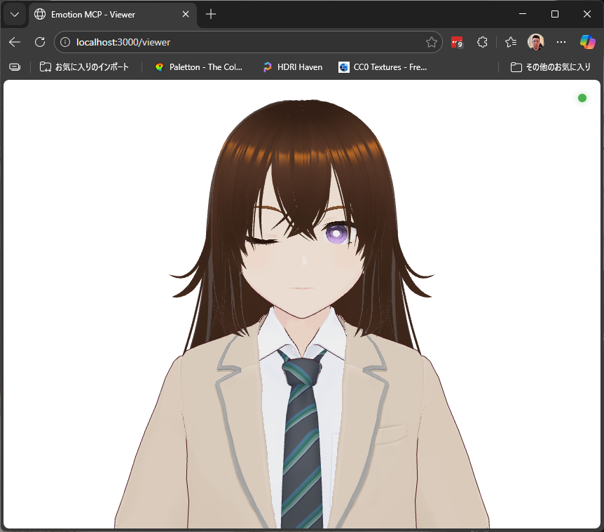
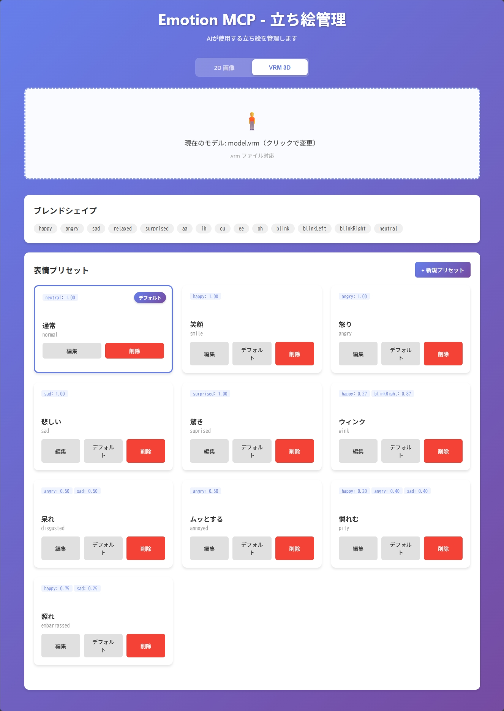

# Emotion MCP

AIアシスタントが自分の感情に合わせて立ち絵を切り替えられるMCP (Model Context Protocol) サーバーです。

動作画面


管理画面



## 特徴

- **2D画像モード**: 立ち絵画像をアップロードして表情を切り替え
- **VRM 3Dモデルモード**: VRoid/VRM形式の3Dモデルをブレンドシェイプで表情制御
- **多彩なトランジション**: フェード、スライド、ズーム、シェイクなど6種類のエフェクト
- **リアルタイム更新**: WebSocketで即座に表情が切り替わる
- **アイドルアニメーション**: VRMモードではまばたき・呼吸の自動アニメーション
- **高速動作**: Bunを使用した爆速起動・実行

## アーキテクチャ

```
┌─────────────────┐
│  Claude Code    │ AIが表情を選択
│  (AI Assistant) │ change_expression("embarrassed", "fade")
└────────┬────────┘
         │ MCP Protocol (stdio)
┌────────▼────────┐
│   MCP Server    │ ツール実装
│  (TypeScript)   │ list_expressions, change_expression
└────────┬────────┘
         │ HTTP API
┌────────▼────────┐
│   HTTP Server   │ WebSocket経由でクライアントに通知
│  (Bun)          │
└────┬───────┬────┘
     │       │
┌────▼────┐ ┌▼─────────┐
│ Admin   │ │ Viewer   │  2D画像 or VRM 3Dモデル
│ UI      │ │          │  (Three.js + @pixiv/three-vrm)
└─────────┘ └──────────┘
```

## セットアップ

### 1. 依存関係のインストール

```bash
bun install
```

### 2. MCPサーバーの設定

使用する環境に応じて、以下のいずれかの設定ファイルに追加してください。

#### Claude Code（CLI / VSCode拡張）

**設定ファイル**: `~/.claude.json`

```json
{
  "mcpServers": {
    "emotion-mcp": {
      "command": "bun",
      "args": ["run", "/absolute/path/to/emotion-mcp/src/server/index.ts"]
    }
  }
}
```

#### Claude Desktop

**設定ファイルの場所:**
- **macOS**: `~/Library/Application Support/Claude/claude_desktop_config.json`
- **Windows**: `%APPDATA%\Claude\claude_desktop_config.json`

```json
{
  "mcpServers": {
    "emotion-mcp": {
      "command": "bun",
      "args": ["run", "/absolute/path/to/emotion-mcp/src/server/index.ts"]
    }
  }
}
```

※ `/absolute/path/to/emotion-mcp` は実際のパスに置き換えてください

### 3. Claude Code / Claude Desktopの起動

設定を反映するため、Claude Code（VSCode）またはClaude Desktopを起動（または再起動）します。

MCPサーバーが起動すると：
- HTTPサーバーが自動的にポート3000で起動
- Viewerが自動的にブラウザで開く

手動でアクセスする場合は以下のURL：

- 管理UI: http://localhost:3000/admin
- Viewer: http://localhost:3000/viewer

**Tips:**

- **Viewerの自動オープンを無効化:**
  ```bash
  AUTO_OPEN_VIEWER=false
  ```

- **ポート番号を変更:**
  ```json
  {
    "mcpServers": {
      "emotion-mcp": {
        "command": "bun",
        "args": ["run", "/absolute/path/to/emotion-mcp/src/server/index.ts"],
        "env": {
          "PORT": "8080"
        }
      }
    }
  }
  ```
  デフォルトは3000。変更した場合は `http://localhost:8080/admin` でアクセス。

### 4. 立ち絵の登録

#### 2D画像モード（デフォルト）

1. http://localhost:3000/admin にアクセス
2. モード切り替えが「2D 画像」になっていることを確認
3. 画像をドラッグ&ドロップまたはクリックしてアップロード
4. 表情名（英数字）と表示名を入力
5. デフォルト表情を設定

#### VRM 3Dモデルモード

1. http://localhost:3000/admin にアクセス
2. モード切り替えで「VRM 3D」を選択
3. VRMファイル（.vrm）をドラッグ&ドロップまたはクリックしてアップロード
4. アップロード後、モデルから検出されたブレンドシェイプ一覧が表示される
5. 「新規プリセット」ボタンでプリセットを作成
   - プリセット名（AIが使用する名前）と表示名を入力
   - 各ブレンドシェイプのスライダーで表情の重みを調整
6. デフォルトプリセットを設定

## 使い方

### 管理UI

**2Dモード:**
- **アップロード**: ドラッグ&ドロップまたはクリックで画像を追加
- **デフォルト設定**: 初期表示する表情を選択
- **削除**: 不要な表情を削除

**VRMモード:**
- **モデルアップロード**: .vrmファイルをアップロード
- **プリセット作成**: ブレンドシェイプのスライダーで表情を調整して保存
- **プリセット編集/削除**: 既存のプリセットを変更・削除
- **デフォルト設定**: 初期表示するプリセットを選択

### AIから表情を変更

Claude Codeとの会話中に、AIが自動的に表情を変更します：

```
AI: べ、別にあんたのために説明したわけじゃないんだからね！
    [change_expression("embarrassed", "quick-fade")]
```

2DモードでもVRMモードでも、MCPツールのインターフェースは同じです。管理UIで設定したモードに応じて、画像の切り替えまたはブレンドシェイプの変更が行われます。

### 利用可能なツール

#### `list_expressions`

登録されている表情の一覧を取得します。2Dモードでは画像表情、VRMモードではプリセット一覧を返します。

```typescript
list_expressions()
```

#### `change_expression`

表情を変更します。

```typescript
change_expression({
  expression: "embarrassed",  // 表情名（2D）またはプリセット名（VRM）
  transition: "fade",          // トランジション（省略可）
  duration: 300                // 時間（ms、省略可）
})
```

**利用可能なトランジション:**

| トランジション | 説明 |
|---|---|
| `fade` | 通常のフェード（デフォルト） |
| `quick-fade` | 素早いフェード |
| `slide` | スライドイン |
| `zoom` | ズームイン |
| `shake` | シェイク（動揺） |
| `instant` | 即座に切り替え |

#### `get_current_expression`

現在表示されている表情を取得します。

```typescript
get_current_expression()
```

## VRM 3Dモデルの詳細

### 対応フォーマット

- VRM 0.x（VRoid Studio旧バージョン等）
- VRM 1.0（VRoid Studio最新版等）

### ブレンドシェイプ

VRMモデルに含まれるブレンドシェイプ（表情モーフ）を自動検出します。一般的なVRMモデルには以下のようなブレンドシェイプが含まれています：

- `happy`, `angry`, `sad`, `relaxed`, `surprised` （基本表情）
- `blink`, `blinkLeft`, `blinkRight` （まばたき）
- `aa`, `ih`, `ou`, `ee`, `oh` （リップシンク）

### アイドルアニメーション

VRMモードでは以下のアイドルアニメーションが自動で動作します：

- **まばたき**: 3〜7秒のランダム間隔で自然なまばたき
- **呼吸**: 胸ボーンの微小なスケール変化による呼吸モーション（約4秒周期）
- **自然な立ちポーズ**: Tポーズから腕を下ろした自然なポーズに自動変換

### カメラ操作（マウス）

VRMモードのViewerでは、マウスでカメラを自由に操作できます：

| 操作 | 動作 |
|---|---|
| 左ドラッグ | カメラ回転 |
| 右ドラッグ | パン（平行移動） |
| ホイール | ズーム |

モデル読み込み時にカメラは顔の高さに自動調整されます。

### 技術スタック

- [Three.js](https://threejs.org/) - 3Dレンダリング（CDN経由、ビルドステップ不要）
- [@pixiv/three-vrm](https://github.com/pixiv/three-vrm) - VRMモデルの読み込みと制御
- Import Maps によるESモジュール読み込み

## 推奨される表情名

AIが理解しやすい表情名の例：

- `normal`: 通常
- `happy`: 嬉しい
- `sad`: 悲しい
- `angry`: 怒り
- `embarrassed`: 照れ
- `surprised`: 驚き
- `worried`: 心配
- `thinking`: 考え中
- `confident`: 自信満々

## トラブルシューティング

### Viewerが自動で開かない

HTTPサーバー起動時に自動でViewerが開かない場合：

1. 手動で http://localhost:3000/viewer を開く
2. ブラウザが見つからないエラーが出る場合は、環境変数で無効化して手動で開く

### WebSocketに接続できない

1. HTTPサーバーが起動しているか確認
2. ブラウザのコンソールでエラーを確認
3. ポート3000が他のアプリケーションで使用されていないか確認

### MCPツールが表示されない

1. 設定ファイルのパスが正しいか確認
2. Claude Code / Claude Desktopを再起動
3. MCPサーバーのログを確認（stderr出力）

### 表情が切り替わらない

1. Viewerページを開いているか確認
2. WebSocketの接続状態を確認（右上の緑色のインジケーター）
3. ブラウザのコンソールでエラーを確認

### VRMモデルが表示されない

1. .vrm ファイルが正しいVRM形式か確認
2. ブラウザがWebGLに対応しているか確認
3. ブラウザのコンソールでThree.jsのエラーを確認
4. モデルファイルのサイズが大きすぎる場合は、VRoid Studioで最適化して再エクスポート

### Windowsでの注意

初回起動時にWindowsファイアウォールのダイアログが表示される場合があります。HTTPサーバーがネットワークアクセスするために必要なので、許可してください。

## 開発

### プロジェクト構造

```
emotion-mcp/
├── src/
│   ├── server/              # バックエンド
│   │   ├── index.ts         # MCPサーバー
│   │   ├── http-server.ts   # HTTPサーバー
│   │   └── storage.ts       # データ永続化
│   ├── client/              # フロントエンド
│   │   ├── admin/           # 管理UI
│   │   └── viewer/          # 表示用クライアント
│   │       ├── app.js       # メインアプリ（2D/VRMモード分岐）
│   │       └── vrm-renderer.js  # VRM 3Dレンダラー
│   └── shared/              # 共通型定義
├── data/                    # データディレクトリ
│   ├── config.json          # 設定（モード、2D表情）
│   ├── vrm-config.json      # VRM設定（プリセット）
│   ├── expressions/         # 2D立ち絵画像
│   └── vrm/                 # VRMモデルファイル
└── package.json
```

### スクリプト

```bash
# HTTPサーバー起動（開発用）
bun run dev:http

# MCPサーバー起動（テスト用）
bun run dev

# ビルド
bun run build
```

## ライセンス

MIT

## 作者

Created with Claude Code & You
